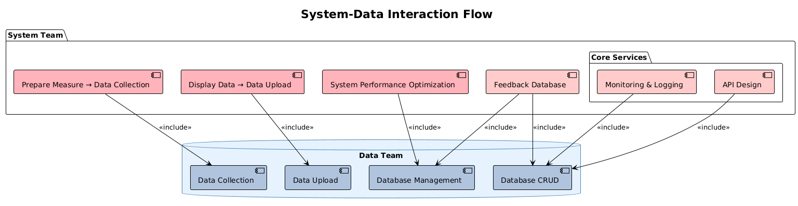
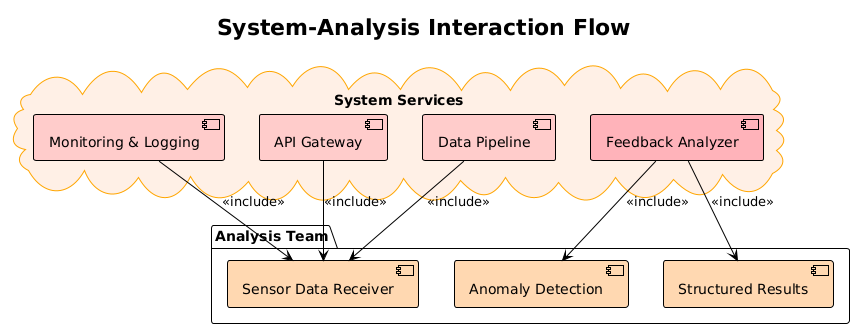

# Software Requirements Specification (SRS)

Revision History:

| Data      | Author     | Description                                                  |
| --------- | ---------- | ------------------------------------------------------------ |
| 2025-4-14 | YuanwuZhu  | First Draft                                                  |
<!--| 2023-3-24 | Aidan, Bob | Add Sequence Diagrams                                        |
| 2023-3-26 | Aidan      | Modify the workflow to a tabular form                        |
| 2023-3-28 | Aidan      | Add section:  Introduction, Concept of Operations, Behavioral Requirement Expected Subsets, Fundamental Assumptions |
| 2023-3-29 | Aidan      | Delete one Use Case: Get Realtime Data (Async)               |
| 2023-4-1  | Aidan      | Grammar mistakes                                             |
| 2023-4-5  | Bob, Aidan | Delete the character of `Sensor` in Sequence Diagrams        |
| 2023-5-11 | Aidan      | Add new Use Cases: 3.6 Send a "Motion Start" Signal to Server & 3.7 Offer QR Code of the Embedded Device to User |
| 2023-5-12 | Bob, Aidan | Update 3.6 and 3.7 Use Cases, delete the response of Server in 3.6, and improve the description in 3.7 |
-->
[TOC]

## 1. Introduction

### 1.1 Intended Audience and Purpose

The purpose of this document is to provide information to guide the development process and ensure that all system requirements are met. The following entities may find this document useful:

Key Customers - This page will detail all application requirements known to the production team. Customers should be able to use the information on this page to determine that their requirements will be properly reflected in the final product.

Users - Potential users can use this document to determine the data flow of the application. In addition, there are a number of system requirements that need to be met before the application can be run. More information on these requirements can be found here.

Development Team - The data interfaces provided by the SYS group are provided here, along with a schematic of the data pathways.

Quality Assurance Team - By developing test procedures based on the system requirements, the Quality Assurance team can create a comprehensive test program to ensure that the requirements are met.

### 1.2 How to use the document
Table of Contents:

1. Introduction
2. Concept of Operations - a generalized description of the purpose of the application  
    2.1 System Context - a detailed description of the specific system requirements needed for the application to operate  
    2.2 System Capabilities - a prose description of all the capabilities available to the different groups during interaction  
    2.3 Use cases - a detailed description of each functional requirement, describing the application environment before and after operation     
3. use cases 
5. expected subset - the level of functionality expected at the checkpoints during the development process 
6. Base Assumptions - Here are the specific details of inputs, outputs, or behaviors that form the basis for the other requirements. 
7. expected changes - the future functionality and direction of the project 
8. Appendices - Detailed information to help you understand this document.   
    8.1 Definitions and Acronyms - For ease of use of this document, any technical terms or acronyms will be listed here  
           8.1.1 Definitions - Definitions of Technical or Special Terms  
           8.1.2 Abbreviations and Acronyms - Any acronyms will be expanded here  
    8.2 References - Any external references that are necessary or helpful to the understanding of this document will be listed here

## 2. Concept of Operations

### 2.1 System Context
**System Requirements:**

- Operating System: Compatible with all operating systems due to the use of a web-based terminal
- Processor: RaspberryPi above Generation 3
- Memory: 4GB RAM
- HDD/SSD: 1 GB 

### 2.2 System capabilities
- Bluetooth Module required
- Network bandwidth 1Mbps

## 3. Use Cases

​		
### 3.1 Case 1: Sys for data

| Author     | Version | Statue    | Date       |
| ---------- | ------- | --------- | ---------- |
| YuanwuZHU  | 1       | Unaudited | 2025-04-14 |

**Brief Introduction**

The system provides an interface for data groups to access the data as well as a data return path.

**Actors**

- SYSTEM,DATA

**Pre-Conditions**

- The database can be used normally

- The network is available and the server is able to send messages to the embedded system.

**Basic Flow**

| **Basic Flow** | DATA                                              | System                                                       |
| -------------- | ------------------------------------------------- | ------------------------------------------------------------ |
| 1              | The database requires an interface to upload and return data  |                                                              |
| 2              |                                                   | The system gives the data group access to upload data as well as giving data back to the data group, allowing the data group to access  |
| 3              |                                                   | Create a data path between ui and data, providing the data interfaces needed for login and access.    |
| 4              | The data group acquires the data through collection and counts it in the database                |                                                              |

<!--**Exception Flows**

| 4a   | Actor                                                        | System                 |
| ---- | ------------------------------------------------------------ | ---------------------- |
|      |                                                              | From Basic Flow step 3 |
| 1    | If the server fails to receive the real-time data from the embedded system, the server **WILL NOT** retry to request again, the data it should have received will be regarded as the latest cached data or an INVALID data (if there are no value cached). |                        |
-->
**Post Conditions**

1. Data received should be cached by the data.

**Supplemental Requirements**

1. Depending on the network environment, the latency of real-time data may vary. Generally, real-time data has a delay of around 200 milliseconds.

2. Real-time data includes the angles, angular velocities, and accelerations in the XYZ directions, as well as the timestamp determined by the  system.
<!-->
**Visual Model**

-->
**Sequence Diagram**

**Revision History**

| Version | Date       | Author     | Description      | Status    |
| ------- | ---------- | ---------- | ---------------- | --------- |
| 1       | 2025-04-14 | YuanwuZHU  | Original Version | Unaudited |

### 3.2 Case 2: SYSTEM for ANALYSIS

| Author     | Version | Statue    | Date       |
| ---------- | ------- | --------- | ---------- |
| YuanwuZHU  | 1       | Unaudited | 2025-04-14 |

**Brief Introduction**

The system service components provide support for the analysis team components, reflecting the interaction logic of the system service in data collection, transmission and other links to help the analysis team carry out data reception, anomaly detection and generation of structured results.

**Actors**

- ANALYSIS

**Pre-Conditions**

- The  system has been powered on.
- Computing servers are working properly

- The network is available and the server is able to send messages to the embedded system.

**Basic Flow**

| **Basic Flow** | Actor                                             | System                                                       |
| -------------- | ------------------------------------------------- | ------------------------------------------------------------ |
| 1              | The Sensor Data Receiver of the Analysis Team receives data from Monitoring & Logging, API Gateway, and Data Pipeline of System Services. |                                                              |
| 2              |                                                   | Monitoring & Logging, API Gateway, Data Pipeline, and Feedback Analyzer in System Services perform functions such as monitoring logging, interface management, data transfer, and feedback analysis. |
| 3              |                                                   | Feedback Analyzer also provides information for Anomaly Detection and Structured Results to assist in anomaly detection and results output.      |
| 4              | Anomaly Detection utilizes received data and Feedback Analyzer information for anomaly identification.             |                                                              |
| 5              | Structured Results combines Feedback Analyzer information to output structured analysis results.                                                   |                                                               |
<!--
**Exception Flows**

| 4a   | Actor                                                        | System                 |
| ---- | ------------------------------------------------------------ | ---------------------- |
|      |                                                              | From Basic Flow step 3 |
| 1    | If the server fails to receive the real-time data from the embedded system, the server **WILL NOT** retry to request again, the data it should have received will be regarded as the latest cached data or an INVALID data (if there are no value cached). |                        |

**Post Conditions**

**Supplemental Requirements**

1. Depending on the network environment, the latency of real-time data may vary. Generally, real-time data has a delay of around 200 milliseconds.

2. Real-time data includes the angles, angular velocities, and accelerations in the XYZ directions, as well as the timestamp determined by the embedded system.

**Visual Model**

-->
**Sequence Diagram**

**Revision History**

| Version | Date       | Author     | Description      | Status    |
| ------- | ---------- | ---------- | ---------------- | --------- |
| 1       | 2025-04-14 | YuanwuZHU  | Original Version | Unaudited |

### 3.3 Case 3: SYSTEM for UI

| Author     | Version | Statue    | Date       |
| ---------- | ------- | --------- | ---------- |
| YuanwuZHU  | 1       | Unaudited | 2025-04-14 |

**Brief Introduction**

The UI Team includes pages for patient management, results feedback, etc., while the System Team covers components for user authentication, performance optimization, etc. The UI Team is connected by the “include” and “extend” relationships.They are connected through “include” and “extend” relationships:
Functional implementation dependency: UI page relies on system components to provide basic services, such as Login Page relies on User Authentication to realize login authentication. Service Support: System components provide support for UI page functionality expansion, such as System Performance Optimization to ensure the performance of each UI page

**Actors**

- UI

**Pre-Conditions**

- The embedded system has been powered on.

- The network is available and the server is able to send messages to the embedded system.

**Basic Flow**

| **Basic Flow** | Actor                                             | System                                                       |
| -------------- | ------------------------------------------------- | ------------------------------------------------------------ |
| 1              | The user initiates the login operation on the Login Page. |                                                              |
| 2              |                                                   | The “Login Page” calls the “User Authentication” component in the “System Team” via the “include” relationship.
The “User Authentication” component in “Infrastructure” is called through the “include” relationship to authenticate the user and allow the user to enter the system related UI page. |
| 3              |                                                   | “Monitoring & Logging” monitors the system status in real time to ensure stable operation of the UI       |
| 4              | The “Display Data→Data Upload” component handles the data display logic, displays the data on the UI page, and supports the uploading of user-operated data, such as uploading feedback data in the “Result Feedback Page
“ uploads feedback data.              |                                                              |
<!--
**Exception Flows**

| 4a   | Actor                                                        | System                 |
| ---- | ------------------------------------------------------------ | ---------------------- |
|      |                                                              | From Basic Flow step 3 |
| 1    | If the server fails to receive the real-time data from the embedded system, the server **WILL NOT** retry to request again, the data it should have received will be regarded as the latest cached data or an INVALID data (if there are no value cached). |                        |

**Post Conditions**

1. Data received should be cached by the server.

For Exception Flow 4a, The server detected the embedded system offline.
-->
**Supplemental Requirements**

1. Depending on the network environment, the latency of real-time data may vary. Generally, real-time data has a delay of around 200 milliseconds.

2. Real-time data includes the angles, angular velocities, and accelerations in the XYZ directions, as well as the timestamp determined by the embedded system.
<!-->
**Visual Model**

-->
**Sequence Diagram**

**Revision History**

| Version | Date       | Author     | Description      | Status    |
| ------- | ---------- | ---------- | ---------------- | --------- |
| 1       | 2023-03-21 | Aidan, Bob | Original Version | Unaudited |

<!--
### 3.1 Case 1: Server Requests Real-time Data

| Author     | Version | Statue    | Date       |
| ---------- | ------- | --------- | ---------- |
| YuanwuZHU  | 1       | Unaudited | 2025-04-14 |

**Brief Introduction**

When the server requests the data, the process starts; When the server gets the data from the embedded system, the process ends.

**Actors**

- Server

**Pre-Conditions**

- The embedded system has been powered on.

- The network is available and the server is able to send messages to the embedded system.

**Basic Flow**

| **Basic Flow** | Actor                                             | System                                                       |
| -------------- | ------------------------------------------------- | ------------------------------------------------------------ |
| 1              | The server **REQUESTs** to obtain real-time data. |                                                              |
| 2              |                                                   | The embedded system get the real-time data from the sensors. |
| 3              |                                                   | The embedded system make a **RESPONSE** to the server.       |
| 4              | The server receives the information.              |                                                              |

**Exception Flows**

| 4a   | Actor                                                        | System                 |
| ---- | ------------------------------------------------------------ | ---------------------- |
|      |                                                              | From Basic Flow step 3 |
| 1    | If the server fails to receive the real-time data from the embedded system, the server **WILL NOT** retry to request again, the data it should have received will be regarded as the latest cached data or an INVALID data (if there are no value cached). |                        |

**Post Conditions**

1. Data received should be cached by the server.

For Exception Flow 4a, The server detected the embedded system offline.

**Supplemental Requirements**

1. Depending on the network environment, the latency of real-time data may vary. Generally, real-time data has a delay of around 200 milliseconds.

2. Real-time data includes the angles, angular velocities, and accelerations in the XYZ directions, as well as the timestamp determined by the embedded system.

**Visual Model**

**Sequence Diagram**

**Revision History**

| Version | Date       | Author     | Description      | Status    |
| ------- | ---------- | ---------- | ---------------- | --------- |
| 1       | 2023-03-21 | Aidan, Bob | Original Version | Unaudited |
<!--
### 3.1 Case 1: Server Requests Real-time Data

| Author     | Version | Statue    | Date       |
| ---------- | ------- | --------- | ---------- |
| YuanwuZHU  | 1       | Unaudited | 2025-04-14 |

**Brief Introduction**

When the server requests the data, the process starts; When the server gets the data from the embedded system, the process ends.

**Actors**

- Server

**Pre-Conditions**

- The embedded system has been powered on.

- The network is available and the server is able to send messages to the embedded system.

**Basic Flow**

| **Basic Flow** | Actor                                             | System                                                       |
| -------------- | ------------------------------------------------- | ------------------------------------------------------------ |
| 1              | The server **REQUESTs** to obtain real-time data. |                                                              |
| 2              |                                                   | The embedded system get the real-time data from the sensors. |
| 3              |                                                   | The embedded system make a **RESPONSE** to the server.       |
| 4              | The server receives the information.              |                                                              |

**Exception Flows**

| 4a   | Actor                                                        | System                 |
| ---- | ------------------------------------------------------------ | ---------------------- |
|      |                                                              | From Basic Flow step 3 |
| 1    | If the server fails to receive the real-time data from the embedded system, the server **WILL NOT** retry to request again, the data it should have received will be regarded as the latest cached data or an INVALID data (if there are no value cached). |                        |

**Post Conditions**

1. Data received should be cached by the server.

For Exception Flow 4a, The server detected the embedded system offline.

**Supplemental Requirements**

1. Depending on the network environment, the latency of real-time data may vary. Generally, real-time data has a delay of around 200 milliseconds.

2. Real-time data includes the angles, angular velocities, and accelerations in the XYZ directions, as well as the timestamp determined by the embedded system.

**Visual Model**

**Sequence Diagram**

**Revision History**

| Version | Date       | Author     | Description      | Status    |
| ------- | ---------- | ---------- | ---------------- | --------- |
| 1       | 2023-03-21 | Aidan, Bob | Original Version | Unaudited |

​		

​	

### 3.2 Case 2: Server Checks Whether the Embedded System is Reachable

| Author     | Version | Statue    | Date       |
| ---------- | ------- | --------- | ---------- |
| Aidan, Bob | 1       | Unaudited | 2023-03-21 |

**Brief Introduction**

When the server wants to check if the embedded system is reachable, it sends an HTTP request message to the embedded system, and the process begins. When the server receives a response message from the embedded system, the process ends.

**Actors**

- Server

**Pre-Conditions**

- The embedded system has been powered on.

**Basic Flow**

| **Basic Flow** | Actor                                                        | System                                                       |
| -------------- | ------------------------------------------------------------ | ------------------------------------------------------------ |
| 1              | The server sends an  **REQUEST** message to the embedded system to determine whether the embedded system is available. |                                                              |
| 2              |                                                              | The embedded system receives the request sent by the server. |
| 3              |                                                              | The embedded system sends the **RESPONSE** message to the server. |
| 4              | The server receives the response message.                    |                                                              |

**Exception Flows**

| 3a   | Actor | System                                                       |
| ---- | ----- | ------------------------------------------------------------ |
|      |       | From Basic Flow step 2                                       |
| 1    |       | When the embedded system sends the response, a network error occurs. |
| 2    |       | The embedded system does nothing, use case ends.             |

| 4a   | Actor                                                        | System                 |
| ---- | ------------------------------------------------------------ | ---------------------- |
|      |                                                              | From Basic Flow step 3 |
| 1    | When the server receives the response message, a network error occurs. |                        |
| 2    | The server makes another attempt to send a **REQUEST**, server will retry for at most three times. There should be a 0.5-second interval between two **REQUESTs**. If server gets the **RESPONSE** from the embedded system, return to Basic Flow step 4. |                        |
| 3    | After server has been failed to connect for three times, server confirms that the embedded system is unreachable, use case ends. |                        |

**Post Conditions**

1. The server confirms that the embedded system is working properly and accessible.

In Exception Flow 4a, server confirms that the embedded system is inaccessible.

**Supplemental Requirements**

1. The Reachability check will be used under many conditions. For example, when a user checks whether an embedded system is connected to the network, the server needs to have a clear understanding of the accessibility of the embedded system, so the server begins a reachability check.
2. During communication, we require that **REQUEST** and **RESPONSE** must correspond one-to-one. Otherwise, it indicates that a network failure has occurred and Exception Flows are triggered. (This constraint applies to all communication issues mentioned later.)

**Visual Model**

**Sequence Diagram**

**Revision History**

| Version | Date       | Author     | Description      | Status    |
| ------- | ---------- | ---------- | ---------------- | --------- |
| 1       | 2023-03-21 | Aidan, Bob | Original Version | Unaudited |

​			

​	

### 3.3 Case 3: Server Requests Sensor Calibration

| Author     | Version | Statue    | Date       |
| ---------- | ------- | --------- | ---------- |
| Aidan, Bob | 1       | Unaudited | 2023-03-21 |

**Brief Introduction**

When the server requests sensor calibration, the process starts; After the server receives the calibration success response or calibration failure response sent by the embedded system, the process ends.

**Actors**

- Server

**Pre-Conditions**

- The embedded system has been powered on.
- The network is available and the server is able to send messages to the embedded system.

**Basic Flow**

| **Basic Flow** | Actor                                              | System                                                       |
| -------------- | -------------------------------------------------- | ------------------------------------------------------------ |
| 1              | The server sends a sensor calibration **REQUEST**; |                                                              |
| 2              |                                                    | After receiving the request, the embedded system sends a response to the server and performs calibration; |
| 3              |                                                    | After the embedded system calibrates the sensor successfully, it sends a **RESPONSE** to the server. |
| 4              | The server receives the information.               |                                                              |

**Exception Flows**

| 2a   | Actor                  | System                                                       |
| ---- | ---------------------- | ------------------------------------------------------------ |
|      | From Basic Flow step 1 |                                                              |
| 1    |                        | When **REQUEST** received, if the sensors have been calibrated in the recently ten seconds, the embedded system will refuse to calibrate and **RESPONSE** the error message to the server, use case ends. |

| 4a   | Actor                                                        | System                 |
| ---- | ------------------------------------------------------------ | ---------------------- |
|      |                                                              | From Basic Flow step 3 |
| 1    | If server failed to receive the information, the server will check the reachability of the embedded system, and Requests Sensor Calibration again if the embedded system is accessible. |                        |

**Post Conditions**

1. The server will receive the information of calibration from the embedded system after the Basic Flow.

**Supplemental Requirements**

During calibration, it should be ensured that the sensor is placed on a horizontal stand. The calibration here refers to the acceleration calibration. Since the acceleration of the sensor is measured by the acceleration due to gravity, calibration should be performed before use.

**Visual Model**

**Sequence Diagram**

**Revision History**

| Version | Date       | Author     | Description      | Status    |
| ------- | ---------- | ---------- | ---------------- | --------- |
| 1       | 2023-03-21 | Aidan, Bob | Original Version | Unaudited |

​			

​	

### 3.4 Case 4: Server Requests to Obtain Sensor Details

| Author     | Version | Statue    | Date       |
| ---------- | ------- | --------- | ---------- |
| Aidan, Bob | 1       | Unaudited | 2023-03-21 |

**Brief Introduction**

When the server requests to obtain the sensor details, the process begins, it ends when the server confirms the response has been received. 

**Actors**

- Server

**Pre-Conditions**

- The embedded system has been powered on.

- The network is available and the server is able to send messages to the embedded system.

**Basic Flow**

| **Basic Flow** | Actor                                                        | System                                                       |
| -------------- | ------------------------------------------------------------ | ------------------------------------------------------------ |
| 1              | The server **REQUESTs** to obtain the sensor details, including sensor name, sensor type and sensor serial number. |                                                              |
| 2              |                                                              | The embedded system  **RESPONSEs** sensors' details to the server. |
| 3              | The server receives the information.                         |                                                              |

**Exception Flows**

| 3a   | Actor                                                        | System                 |
| ---- | ------------------------------------------------------------ | ---------------------- |
|      |                                                              | From Basic Flow step 2 |
| 1    | If the server does not receive the **RESPONSE**, it should check the reachability of the embedded system, and try to obtain the sensor details again if the embedded system is reachable (return to Basic Flow step 1). |                        |
| 2    | If the embedded system is not reachable, use case ends.      |                        |

**Post Conditions**

1. Server can obtain sensor details, including sensor model, sensor serial number.
2. The application returns to the state before request.

**Supplemental Requirements**

1. The details of the sensors are part of the configuration data of the embedded system, even when some sensor runs out of battery, the sensor details **CAN** still be acquired.

2. Sensor details contain sensor name, sensor type and sensor serial number.

**Visual Model**

**Sequence Diagram**

**Revision History**

| Version | Date       | Author     | Description      | Status    |
| ------- | ---------- | ---------- | ---------------- | --------- |
| 1       | 2023-03-21 | Aidan, Bob | Original Version | Unaudited |

​			

​	

### 3.5 Case 5: Server Requests to Obtain the Sensor Status

| Author     | Version | Statue    | Date       |
| ---------- | ------- | --------- | ---------- |
| Aidan, Bob | 1       | Unaudited | 2023-03-21 |

**Brief Introduction**

When the server requests to obtain the sensor status, the process begins; it ends when the server confirms the response has been received.

**Actors**

- Server

**Pre-Conditions**

- The embedded system has been powered on.
- The network is available and the server is able to send messages to the embedded system.

**Basic Flow**

| **Basic Flow** | Actor                                                        | System                                                       | Sensor                                                       |
| -------------- | ------------------------------------------------------------ | ------------------------------------------------------------ | ------------------------------------------------------------ |
| 1              | The server **REQUESTs** to obtain the current status of the sensor, including sensor connection status, sensor power. |                                                              |                                                              |
| 2              |                                                              | The embedded system receives the request and try to connect with the sensors. |                                                              |
| 3              |                                                              |                                                              | The sensors reply the embedded system with their status and power. |
| 4              |                                                              | The embedded system collects the data from sensors and makes a **RESPONSE** to the server. |                                                              |
| 5              | The server receives the information.                         |                                                              |                                                              |

**Exception Flows**

| 2a   | Actor                   | System                                                       | Sensor                                                       |
| ---- | ----------------------- | ------------------------------------------------------------ | ------------------------------------------------------------ |
|      | From Basic Flow step 1. |                                                              |                                                              |
| 1    |                         | The embedded system receives the request and sends the request to the sensors. If the embedded system did not receive the response, the embedded system resend the request to the sensor for at most three times. |                                                              |
| 2    |                         |                                                              | If some sensor fails to response for three times, it will be regarded as **OFF**, return to Basic Flow step 4. |

| 5a   | Actor                                                        | System                  |
| ---- | ------------------------------------------------------------ | ----------------------- |
|      |                                                              | From Basic Flow step 4. |
| 1    | If the server can not receive the **RESPONSE** from the embedded system. The server resends the **REQUEST** as in Basic Flow step 1 for at most three times, if the server gets the **RESPONSE** from the embedded system, use case ends normally. There should be a 0.5-second interval between two **REQUESTs**. |                         |
| 2    | After three unsuccessful attempts, the server determines that the embedded system is unreachable, use case ends with exception. |                         |

**Post Conditions**

1. Users can obtain sensor status information, including sensor power after the Basic Flow ends.

**Supplemental Requirements**

None.

**Visual Model**

**Sequence Diagram**

**Revision History**

| Version | Date       | Author     | Description      | Status    |
| ------- | ---------- | ---------- | ---------------- | --------- |
| 1       | 2023-03-21 | Aidan, Bob | Original Version | Unaudited |

### 3.6 Send a "Motion Start" Signal to Server

| Author     | Version | Statue    | Date       |
| ---------- | ------- | --------- | ---------- |
| Aidan | 1       | Unaudited | 2023-05-11 |

**Brief Introduction**

When the embedded system detects that the User starts moving, it sends a "motion start" signal to the server.

**Actors**

- Server

**Pre-Conditions**

- The embedded system has been powered on.
- The network is available and the server is able to send messages to the embedded system.

**Basic Flow**

| **Basic Flow** | Actor | System                                                       |
| -------------- | ----- | ------------------------------------------------------------ |
| 1              |       | When the device is powered on, the embedded system starts monitoring real-time data and at some point the onset of motion is detected. |
| 2              |       | The embedded system sends a "motion start" signal to the Server. |

**Post Conditions**

1. Server receives the "motion start" signal and can make corresponding processing according to the current situation.

**Supplemental Requirements**

1. Algorithm for monitoring motion: When the p-norm (the value of p is fixed) between two adjacent sensor data vectors detected during a period of time (fixed time length) is greater than a certain value, we think motion starts.
2. We **do not guarantee** that Server is not recording while providing the "motion start" signal. After receiving the signal, Server does **not need** to send response to the embedded system, but processes the signal by itself according to the current system operation.

**Visual Model**

**Sequence Diagram**

**Revision History**

| Version | Date       | Author     | Description      | Status    |
| ------- | ---------- | ---------- | ---------------- | --------- |
| 1       | 2023-05-11 | Aidan | Original Version | Unaudited |
|2|2023-05-12|Bob, Aidan|Revised Version||

### 3.7 Offer QR Code of the Embedded Device to User

| Author     | Version | Statue    | Date       |
| ---------- | ------- | --------- | ---------- |
| Aidan | 1       | Unaudited | 2023-05-11 |

**Brief Introduction**

After the embedded device is turned on, the QR Code of the embedded device will display on the screen. And Android App use code scanning for device binding.

**Actors**

- User

**Pre-Conditions**

- The embedded device has been powered on.

**Basic Flow**

| **Basic Flow** | Actor                                                        | System                                                       |
| -------------- | ------------------------------------------------------------ | ------------------------------------------------------------ |
| 1              |                                                              | When the embedded device is turned on, the QR Code is displayed on the screen of raspberry pi. |
| 2              | The user uses Android App to scan the QR code for device binding. |                                                              |

**Visual Model**

**Revision History**

| Version | Date       | Author     | Description      | Status    |
| ------- | ---------- | ---------- | ---------------- | --------- |
| 1       | 2023-05-11 | Aidan | Original Version | Unaudited |
| 2 | 2023-05-12 | Bob, Aidan | Revised Version |  |
-->
## 4. Behavioral Requirements

### 4.1 System Inputs and Outputs
#### 4.1.1 Inputs
- HTTP POST request from server.

#### 4.1.2 Outputs
- HTTP Response for the request.
- Send a "Motion Start" Signal (HTTP POST request) to Server
- Offer QR Code of the Embedded Device to User

### 4.2 Quality Requirements
- Request Response time: When the embedded system get a request from server, the response should be generated within 0.1 seconds;
- The Round-Trip time from embedded system to the server should below 0.3 seconds.

## 5. Expected Subsets
### 5.1 L0

This version is able to collect data from sensors and store it locally.

### 5.2 L1 

This version can upload the data collected from the sensor to the server in real time for real-time analysis; it can provide functions such as sensor status and sensor detailed information to the server; it can respond to requests from the server to detect whether it is reachable.

## 6. Fundamental Assumptions
*暂时为空

## 7. Expected Changes
*暂时为空

## 8. Appendices

### 8.1 Definitions and acronyms

#### 8.1.1 Definitions 

| Keyword      | Definitions                                                  |
| ------------ | ------------------------------------------------------------ |
| System       | The Embedded system                                          |
| INVALID data | INVALID data refers to a frame of data that is zero at the corresponding data position for all sensors |
|              |                                                              |
|              |                                                              |

#### 8.1.2 Acronyms and abbreviations 

| Acronym or Abbreviation | Definitions |
| ----------------------- | ----------- |
|                         |             |
|                         |             |
|                         |             |

### 8.2 References

