# Software Design Specification (SDS)

Revision History: 

| Date      | Author   | Description    |
| ----      | ------   | -----------    |
| May 20    | WU, ZHU  | Forth  version |

<style>#rev +table td:nth-child(1) { white-space: nowrap }</style>
<div id="rev"></div>

[toc]

## 1. Introduction

### 1.1 Intended Audience and Purpose

The document is intended to help the customer understand the system design, and serves as the basis of task division and inter-module communication, providing design information for developers and testers.

### 1.2 How to use the document

The document is organized as follows:

- show the control and data flow of the whole system
- show the detailed design of  modules

## 2. Control and Data flow Design
### 2.1 Contex
- The data/control flow of this system is described for the following three users: data flow analysis
**2.1.1 Data Flow Analysis**  
---

**1. Data Display (Joint Angle Status)**  
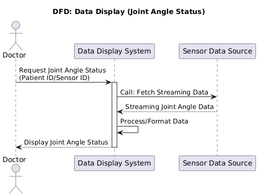  

**Core Process**  
1. Request Initiation  
   • Data Flow:  

     ◦ `Doctor` → Request Joint Angle Status (Patient ID/Sensor ID) → `Data Display System`  

       ◦ The doctor requests joint angle data using a patient ID or sensor ID.  


2. Data Retrieval & Processing  
   • Data Flow:  

     ◦ `Data Display System` → Call: Fetch Streaming Data → `Sensor Data Source`  

       ◦ The system fetches real-time streaming data from sensors.  

     ◦ `Sensor Data Source` → Streaming Joint Angle Data → `Data Display System`  

       ◦ Raw joint angle data is transmitted back.  

     ◦ Internal Process: `Process/Format Data`  

       ◦ Data is formatted into visualizable charts or tables.  


3. Result Delivery  
   • Data Flow:  

     ◦ `Data Display System` → Display Joint Angle Status → `Doctor`  

       ◦ Processed data is displayed to the doctor.  


**Key Details**  
• Covered Text:  

  `DFD: Data Display (Joint Angle Status)`, `Call: Fetch Streaming Data`, `Process/Format Data`.  

---

**2. Measurement Preparation Page**  
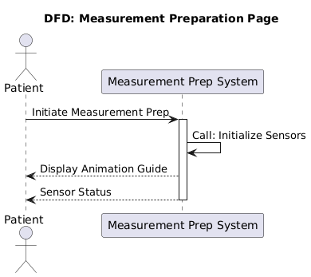  

**Core Process**  
1. Initiation  
   • Data Flow:  

     ◦ `Patient` → Initiate Measurement Prep → `Measurement Prep System`  

       ◦ The patient triggers the measurement preparation process.  


2. Sensor Initialization  
   • Data Flow:  

     ◦ `Measurement Prep System` → Call: Initialize Sensors → Sensor Hardware  

       ◦ System activates and calibrates sensors (e.g., Bluetooth pairing).  

     ◦ Feedback: `Sensor Status`  

       ◦ Returns sensor readiness or error codes (e.g., "Connected" or "Error 0x12").  


3. Guidance Display  
   • Data Flow:  

     ◦ `Measurement Prep System` → Display Animation Guide → `Patient`  

       ◦ Shows step-by-step animations (e.g., sensor placement instructions).  


**Key Details**  
• Covered Text:  

  `DFD Measurement Preparation Page`, `Initiate Measurement Prep`, `Call: Initialize Sensors`.  

---

**3. Registration Info**  
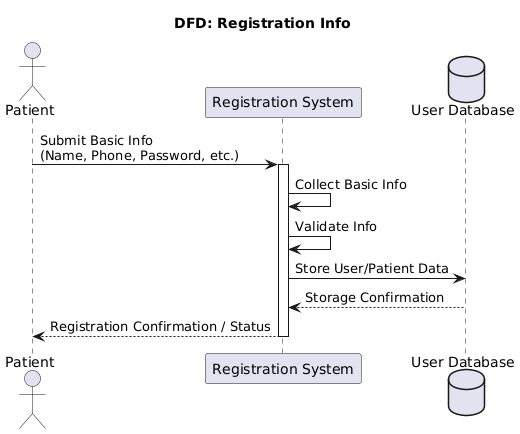  

**Core Process**  
1. Data Submission  
   • Data Flow:  

     ◦ `Patient` → Submit Basic Info (Name, Phone, Password, etc.) → `Registration System`  

       ◦ Patient provides registration details.  


2. Validation & Storage  
   • Data Flow:  

     ◦ `Registration System` → Collect Basic Info → Caches input data.  

     ◦ → Validate Info → Checks format (e.g., valid phone number) and uniqueness.  

     ◦ → Store User/Patient Data → `User Database`  

       ◦ Persists validated data.  

     ◦ `User Database` → Storage Confirmation → Confirms successful storage.  


3. Result Feedback  
   • Data Flow:  

     ◦ `Registration System` → Registration Confirmation/Status → `Patient`  

       ◦ Returns success or error messages (e.g., "Phone already registered").  


**Key Details**  
• Covered Text:  

  `DFD: Registration Info`, `Validate Info`, `Store User/Patient Data`.  

---

**4. Doctor Info Management**  
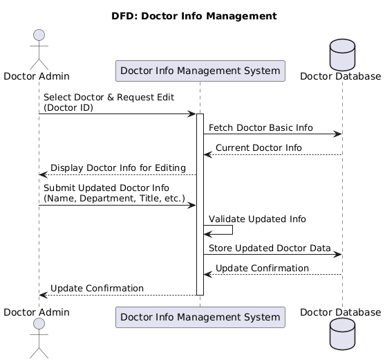  

**Core Process**  
1. Selection & Data Retrieval  
   • Data Flow:  

     ◦ `Doctor Admin` → Select Doctor & Request Edit (Doctor ID) → `Doctor Info Management System`  

       ◦ Admin selects a doctor to edit.  

     ◦ `Doctor Database` → Current Doctor Info → `Doctor Info Management System`  

       ◦ Retrieves existing doctor data (e.g., name, department).  


2. Editing & Validation  
   • Data Flow:  

     ◦ `Doctor Admin` → Submit Updated Doctor Info (Name, Department, Title, etc.) → System  

       ◦ Submits edited fields.  

     ◦ → Validate Updated Info → Verifies data integrity (e.g., valid department).  


3. Storage & Confirmation  
   • Data Flow:  

     ◦ → Store Updated Doctor Data → `Doctor Database`  

       ◦ Updates the database.  

     ◦ → Update Confirmation → Returns success/failure status.  


**Key Details**  
• Covered Text:  

  `DFD: Doctor Info Management`, `Validate Updated Info`, `Store Updated Doctor Data`.  

---

**5. Login Page (Patient/Doctor) - Diagram 1**  
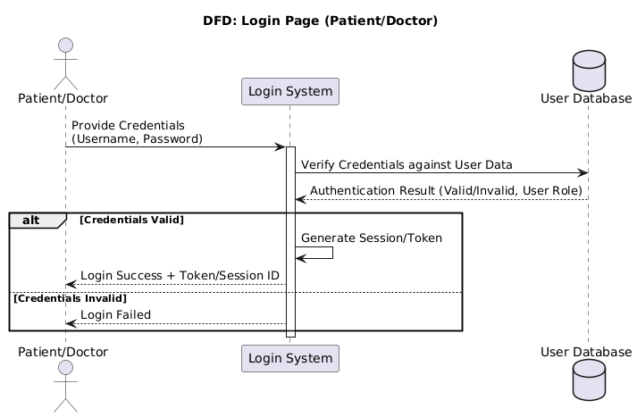  

**Core Process**  
1. Credential Submission  
   • Data Flow:  

     ◦ `Patient/Doctor` → Provide Credentials (Username, Password) → `Login System`  

       ◦ User submits login details.  


2. Verification  
   • Data Flow:  

     ◦ `Login System` → Verify Credentials against User Data → `User Database`  

       ◦ Compares credentials with stored data.  

     ◦ `User Database` → Authentication Result (Valid/Invalid, User Role) → System  


3. Result Handling  
   • Branch:  

     ◦ Valid: → Generate Session/Token → `Login Success + Token/Session ID`.  

     ◦ Invalid: → Login Failed → Error message.  


**Key Details**  
• Covered Text:  

  `DFD: Login Page (Patient/Doctor)`, `Verify Credentials against User Data`, `Authentication Result`.  

---

**6. Login Page (Patient/Doctor) - Diagram 2**  
  

**Core Process**  
1. Credential Interaction  
   • Data Flow:  

     ◦ `Patient/Doctor` → Provide Credentials → `Login System`  

       ◦ Transmits encrypted credentials.  


2. Database Verification  
   • Data Flow:  

     ◦ `Login System` → Verify Credentials against User Data → `User Database`  

       ◦ Validates password hashes.  


3. Session Generation  
   • Data Flow:  

     ◦ Valid Path: → Generate Session/Token → JWT or session ID.  

     ◦ → Login Success + Token/Session ID → Redirects to dashboard.  

     ◦ Invalid Path: → Login Failed → "Invalid credentials" message.  


**Key Details**  
• Covered Text:  

  `Generate Session/Token`, `Login Success + Token/Session ID`.  

---

**7. Patient Management Page**  
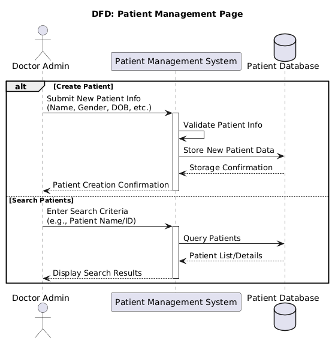  

**Core Process**  
1. Create Patient  
   • Data Flow:  

     ◦ `Doctor Admin` → Submit New Patient Info (Name, Gender, DOB, etc.) → `Patient Management System`  

       ◦ Inputs patient demographics.  

     ◦ → Validate Patient Info → Checks mandatory fields and formats.  

     ◦ → Store New Patient Data → `Patient Database`  

       ◦ Saves validated data.  

     ◦ → Patient Creation Confirmation → Returns success status.  


2. Search Patients  
   • Data Flow:  

     ◦ `Doctor Admin` → Enter Search Criteria (e.g., Patient Name/ID) → System  

       ◦ Submits search parameters.  

     ◦ → Query Patients → `Patient Database`  

       ◦ Executes SQL queries (e.g., fuzzy search).  

     ◦ → Display Search Results → Shows matching patients.  


2.1.2 Control Flow Analysis  

---

2.1.2.1 **Doctor Info Management Control Flow (Admin)**  
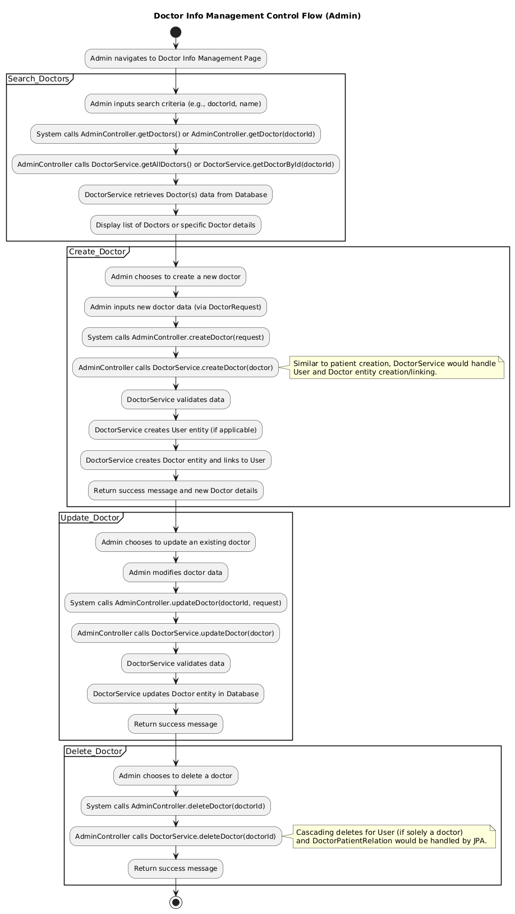  

2.1.2.1.1 **Search Doctors**  
Control Flow:  
1. Admin Action:  
   • Admin navigates to Doctor Info Management Page.  

   • Inputs search criteria (e.g., `doctorId`, name).  


2. System Calls:  
   • `AdminController.getDoctors()` (for multiple results) or `AdminController.getDoctorById()` (single doctor).  

   • `AdminController` delegates to `DoctorService.getAllDoctors()` or `DoctorService.getDoctorById()`.  


3. Data Interaction:  
   • `DoctorService` retrieves doctor data from the database.  

   • Displays a list of doctors or specific doctor details.  


2.1.2.1.2 **Create Doctor**  
Control Flow:  
1. Admin Action:  
   • Admin chooses to Create a New Doctor.  

   • Inputs new doctor entry and links to a `User` entity.  


2. System Workflow:  
   • Calls `AdminController.createDoctor(request)`.  

   • `AdminController` delegates to `DoctorService.createDoctor(doctor)`.  


3. Validation & Entity Creation:  
   • `DoctorService` validates input data.  

   • Creates a `User` entity (if applicable).  

   • Creates a `Doctor` entity and links it to the `User`.  


4. Result:  
   • Returns a success message and new doctor details.  


2.1.2.1.3 **Update Doctor**  
Control Flow:  
1. Admin Action:  
   • Admin modifies doctor data.  


2. System Workflow:  
   • Calls `AdminController.updateDoctor(doctor)`.  

   • `AdminController` delegates to `DoctorService.updateDoctor()`.  


3. Validation & Update:  
   • `DoctorService` validates data.  

   • Updates the `Doctor` entity in the database.  


4. Result:  
   • Returns a success message.  


2.1.2.1.4 **Delete Doctor**  
Control Flow:  
1. Admin Action:  
   • Admin triggers deletion.  


2. System Workflow:  
   • Calls `AdminController.deleteDoctor(doctor)`.  

   • `AdminController` delegates to `DoctorService.deleteDoctor(doctor)`.  


3. Cascading Deletes:  
   • `DoctorPatientRelation` records are handled automatically by JPA.  


4. Result:  
   • Returns a success message.  


---

2.1.2.2 **Patient Management Control Flow (Admin)**  
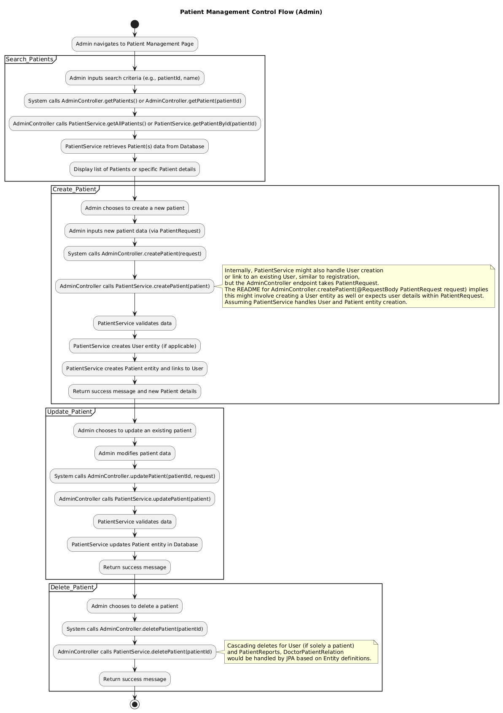  

2.1.2.2.1 **Search Patients**  
Control Flow:  
1. Admin Action:  
   • Admin navigates to Patient Management Page.  

   • Inputs search criteria (e.g., `patientId`, name).  


2. System Calls:  
   • `AdminController.getPatients()` (multiple results) or `AdminController.getPatientById()` (single patient).  

   • `AdminController` delegates to `PatientService.getPatients()` or `PatientService.getPatientById()`.  


3. Data Interaction:  
   • `PatientService` retrieves patient data from the database.  

   • Displays a list of patients or specific patient details.  


2.1.2.2.2 **Create Patient**  
Control Flow:  
1. Admin Action:  
   • Admin inputs new patient data via `PatientRequest`.  


2. System Workflow:  
   • Calls `AdminController.createPatient(request)`.  

   • `AdminController` delegates to `PatientService.createPatient()`.  


3. Validation & Entity Creation:  
   • `PatientService` validates input data.  

   • Creates a `User` entity (if applicable).  

   • Creates a `Patient` entity and links it to the `User`.  


4. Result:  
   • Returns a success message and new patient details.  


2.1.2.2.3 **Update Patient**  
Control Flow:  
1. Admin Action:  
   • Admin modifies patient data.  


2. System Workflow:  
   • Calls `AdminController.updatePatient(request)`.  

   • `AdminController` delegates to `PatientService.updatePatient()`.  


3. Validation & Update:  
   • `PatientService` validates data.  

   • Updates the `Patient` entity in the database.  


4. Result:  
   • Returns a success message.  


2.1.2.2.4 **Delete Patient**  
Control Flow:  
1. Admin Action:  
   • Admin triggers deletion.  


2. System Workflow:  
   • Calls `AdminController.deletePatient(patient)`.  

   • `AdminController` delegates to `PatientService.deletePatient()`.  


3. Cascading Deletes:  
   • Deletes the linked `User` entity (if the user is solely a patient).  

   • Handles `DoctorPatient` relationships via JPA.  


4. Result:  
   • Returns a success message.  


---

2.1.2.3 **Data Display (Joint Angle Status) Control Flow (Doctor)**  
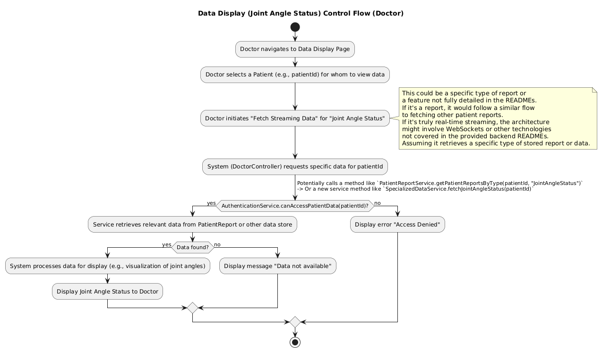  

2.1.2.3.1 **Data Retrieval Workflow**  
1. Doctor Action:  
   • Doctor navigates to Data Display Page and selects a patient (e.g., `patientId`).  


2. System Workflow:  
   • Calls `DoctorController.getPatientReportsByType(patientId, "JointAngleStatus")` or `SpecializedDataService.fetchJointAngleStatus(patientId)`.  


3. Authorization Check:  
   • `AuthorizationService.canAccessPatientData(patientId)` verifies access rights.  


4. Result Handling:  
   • Authorized & Data Found:  

     ◦ Processes data for display (e.g., joint angle visualization).  

     ◦ Displays Joint Angle Status.  

   • Unauthorized: Displays "Access Denied" error.  

   • No Data Found: Displays "Data not available".  


5. Note:  
   • Real-time streaming may involve WebSocket (not detailed in backend READMEs).  


---

2.1.2.4 **Login Control Flow**  
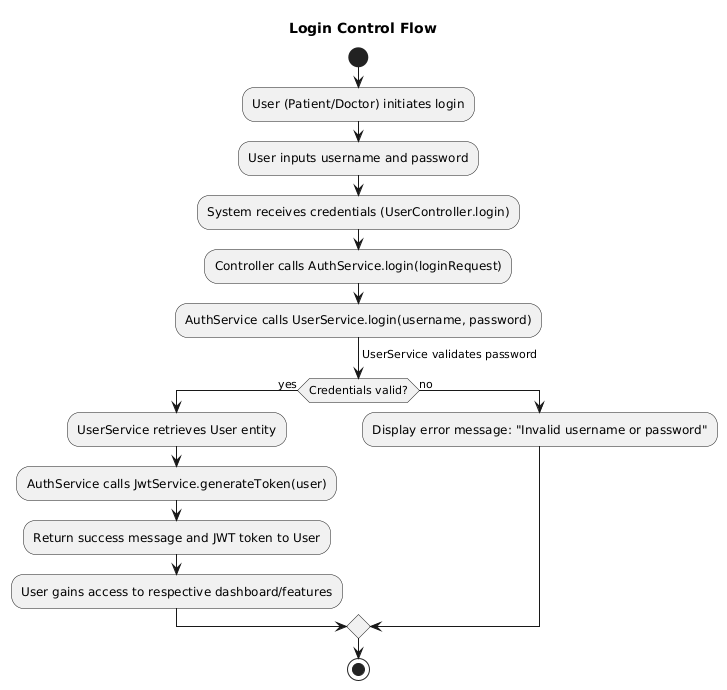  

2.1.2.4.1 **Credential Validation**  
1. User Action:  
   • User (Patient/Doctor) inputs `username` and `password`.  


2. System Workflow:  
   • `UserController.login()` receives credentials.  

   • `AuthService.login(loginRequest)` delegates to `UserService.login(username, password)`.  


3. Validation:  
   • Valid Credentials:  

     ◦ Retrieves `User` entity.  

     ◦ Generates JWT token via `JwtService.generateToken(user)`.  

     ◦ Returns success message and token.  

   • Invalid Credentials: Displays "Invalid username or password".  


4. Outcome:  
   • User gains access to their respective dashboard/features.  


---

2.1.2.5 **Result Feedback Page Control Flow (Doctor)**  
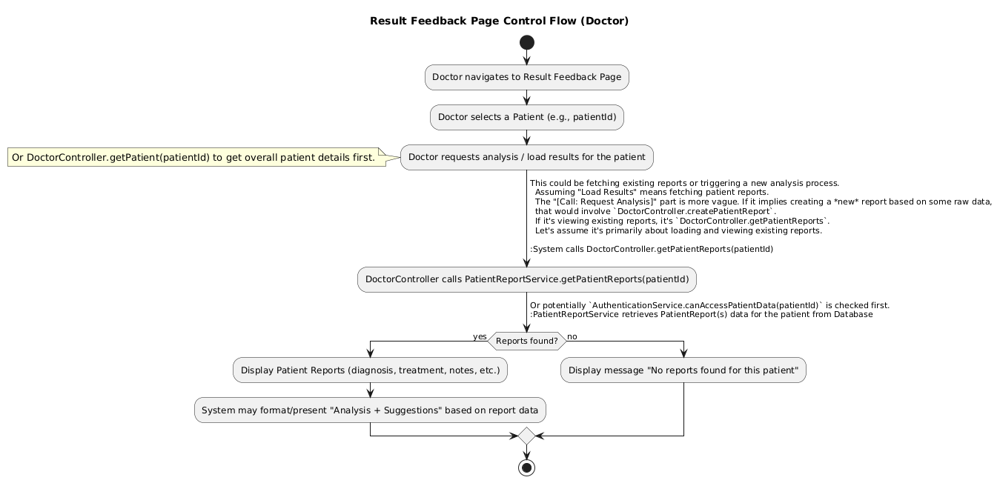  

2.1.2.5.1 **Report Handling**  
1. Doctor Action:  
   • Doctor navigates to Result Feedback Page and selects a patient (e.g., `patientId`).  


2. System Workflow:  
   • Calls `DoctorController.getPatientReports(patientId)`.  

   • `PatientReportService` retrieves reports from the database.  


3. Result Handling:  
   • Reports Found:  

     ◦ Displays diagnosis, treatment, and system-generated suggestions.  

   • No Reports Found: Displays "No reports found for this patient".  


---

2.1.2.6 **Registration Control Flow**  
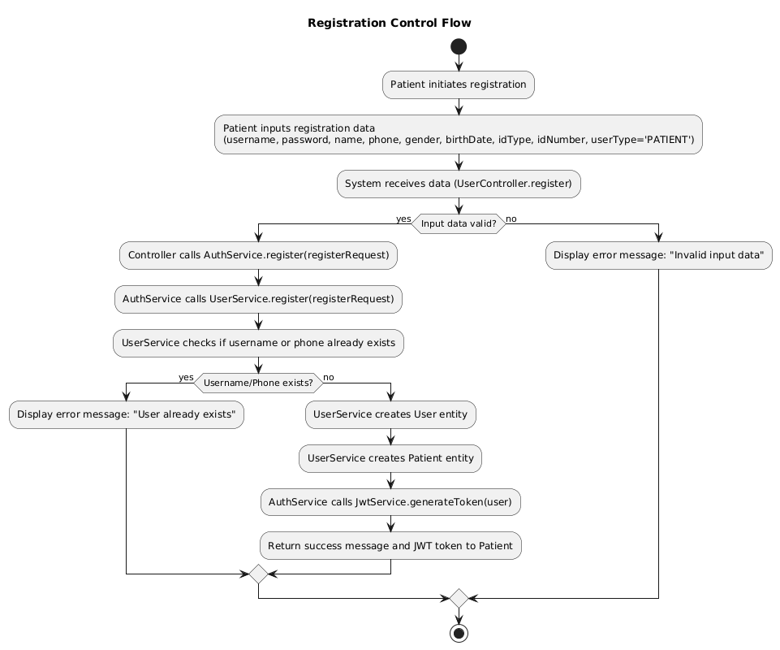  

2.1.2.6.1 **Registration Steps**  
1. Patient Action:  
   • Inputs registration data (`username`, `password`, demographics, `userType='PATIENT'`).  


2. System Workflow:  
   • `UserController.register` receives data.  

   • Validates input and checks for duplicate `username`/`phone`.  


3. Entity Creation:  
   • Creates `User` and `Patient` entities.  


4. Result:  
   • Returns success message and JWT token.  


---

2.1.2.7 **Measurement Preparation Page Control Flow (Patient)**  
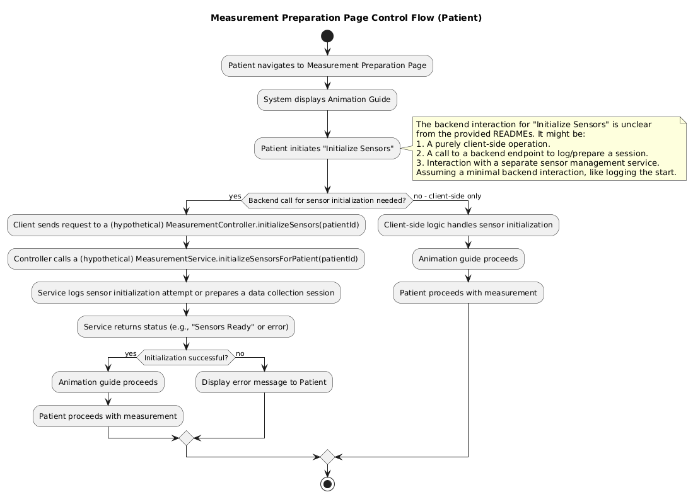  

2.1.2.7.1 **Sensor Initialization**  
1. Patient Action:  
   • Navigates to Measurement Preparation Page and triggers "Initialize Sensors".  


2. System Workflow:  
   • Backend Interaction:  

     ◦ Calls `MeasurementController.init()` to log/prepare a session.  

     ◦ `MeasurementService` handles sensor initialization.  

   • Client-Side Only: Local logic initializes sensors.  


3. Result Handling:  
   • Success: Animation guide proceeds; patient starts measurement.  

   • Failure: Displays error message.  


<!--
## 2. System Design
### 2.1 Context

- The embedded system module is divided in three part. The first part is the Router to respond to the requests from the server. The second part is four function components. They are called by Router to complete requests. The last part is DataCollector. It serves as a medium for interacting with sensors.
- The embedded system is planned to develop with python

### 2.2 Architecture
#### 2.2.1 Component Diagram
- version 1.0


## 3. Detailed Design

### 3.1 Class Diagram

version 1.0


### 3.2 Class Design


#### 3.2.1 `Router`

##### `Attribute`

```
IP: string		
```

The IP of server

```
Port: int
```

```
transactionlist: list
```

The list of objects for processing requests.

##### `Operation`

```
Router.getResponse(dataInput: dict): dict
```

Call different functions of different objects in `transactionlist` according to `dataInput` to process server requests.

Return `dict` always.

```
Router.start(): void
```

Start sensor clients to connect with sensors. And start http server to  wait and process server requests.

Return `None` always.


#### 3.2.2 `Transaction`

##### `Attribute`

```
collectorlist: list
```

A list of SensorCollector objects.

##### `Operation`

```
Transaction.getResponse(): dict
```

Process requests received by Router.

Return `dict` always. 

```
Transaction.checkSuitable(dataInput: dict): bool
```

Check if the request type matches the current object.

Return `true` if match successfully,  `false` otherwise.


#### 3.2.3 `RealTimeData`

##### `Attribute`

##### `Operation`

```
RealTimeData.getResponse(): dict
```

Call `SensorCollector.getRealtimeData()` to request real-time data from sensors.

Return `dict` always.

```
RealTimeData.checkSuitable(): bool
```

Check if the request matches the type of request that can be processed

Return `true` if match successfully,  `false` otherwise.


#### 3.2.4 `SensorStatus`

##### `Attribute`

##### `Operation`

```
SensorStatus.getResponse(): dict
```

Call `SensorCollector.getSensorStatus()` to request sensor status information from sensors.

Return `dict` always.

```
SensorStatus.checkSuitable(): bool
```

Check if the request matches the type of request that can be processed

Return `true` if match successfully,  `false` otherwise.


#### 3.2.5 `SensorDetails`

##### `Attribute`

##### `Operation`

```
SensorDetails.getResponse(): dict
```

Get the sensors detail.

Return `dict` always.

```
SensorDetails.checkSuitable(): bool
```

Check if the request matches the type of request that can be processed

Return `true` if match successfully,  `false` otherwise.


#### 3.2.6 `SensorCalibration`

##### `Attribute`

##### `Operation`

```
SensorCalibration.getResponse(): dict
```

Call `SensorCollector.calibrateSensor()` to perform sensors calibration.

Return `dict` always.

```
SensorCalibration.checkSuitable(): bool
```

Check if the request matches the type of request that can be processed

Return `true` if match successfully,  `false` otherwise.


#### 3.2.7 `SensorCollector`

##### `Attribute`

```
datatranform: DataTranform
```

A object which can call `transformData()` to transform data.

```
Mac: string
```

The Mac of sensor.

##### `Operation`

```
SensorCollector.getRealtimeData(): dict
```

Request real-time data from sensors and then call `DataTransform.transformData()` to transform the format of data.

Return `dict` always.

```
SensorCollector.getSensorStatus(): dict
```

Request request sensor status information from sensors and then call `DataTransform.transformData()` to transform the format of data.

Return `dict` always.

```
SensorCollector.calibrate(): dict
```

Perform sensors calibration.

Return `dict` always.

```
SensorCollector.start(): void
```

Connect with sensor, request data from sensor and check if connection is maintained, if not, reconnect with sensor.

Return `None` always.


#### 3.2.8 `DataTransform`

##### `Attribute`

##### `Operation`

```
DataTransform.transformData(originData: dytes, type: string): dict
```

Transform the format of data from `dytes` to `double`.

Return `dict` always.
-->