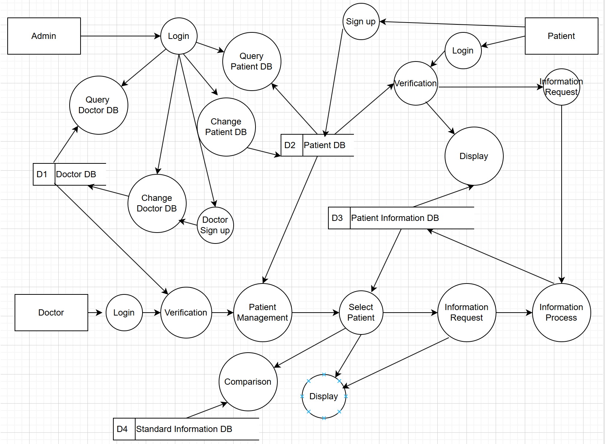

# Software Design Specification (SDS)

Revision History: 

| Date      | Author   | Description    |
| ----      | ------   | -----------    |
| May 7     | ZHU, WU  | Second version |

<style>#rev +table td:nth-child(1) { white-space: nowrap }</style>
<div id="rev"></div>

[toc]

## 1. Introduction

### 1.1 Intended Audience and Purpose

The document is intended to help the customer understand the system design, and serves as the basis of task division and inter-module communication, providing design information for developers and testers.

### 1.2 How to use the document

The document is organized as follows:

- show the control and data flow of the whole system
- show the detailed design of  modules

## 2. Control and Data flow Design
### 2.1 Contex
- The data/control flow of this system is described for the following three users: data flow analysis
#### 2.1.1 Data Flow Analysis
##### 2.1.1.1. User authentication process
Login → Verification

The user (doctor or patient) enters the account password, and the system completes the identity verification by comparing D1 (doctor database) or D2 (patient database).

Sign up

Patient registration: directly add new records to D2.

Doctor registration: to be handled by Admin, reflecting the hierarchy of authority. 2.

##### 2.1.1.2. Core database interaction
Query

Supports general query operations for D1-D4 (e.g., retrieve doctor/patient information, historical data, standard joint data).

Change

Allow authorised users (e.g. Admin) to add, delete and modify the database.

##### 2.1.1.3. Patient Data Management Process
Patient Management → Select Patient

After logging in, the doctor retrieves a list of all patients from D2, and after selecting a specific patient, obtains detailed information from D3 (patient history database).

Information Request

Triggers a request for data collection from D3, which may be used to generate reports or analyses.

##### 2.1.1.4. Data Comparison and Presentation
Comparison

Compares selected patient joint data with D4 (standard joint database) (e.g. diagnostic reference).

Display

Comparison results or raw data are presented in a specific format (e.g. graph, report) through the interface.

#### 2.1.2 Control Flow Analysis
Privilege Control

Admin has the highest privileges to manage Doctor Sign up and direct modification of the database.

Doctors only have access to the Patient Management module and cannot modify the core database (e.g. D1).

Patients can only register/log in and have no access to the system.

Process Trigger Logic

The Information Process is the central hub, connecting data collection (D3), comparison (D4) and display.

The Compare operation relies on data inputs from Select Patient and D4, reflecting the conditional dependencies of the control flow.

<!--
## 2. System Design
### 2.1 Context

- The embedded system module is divided in three part. The first part is the Router to respond to the requests from the server. The second part is four function components. They are called by Router to complete requests. The last part is DataCollector. It serves as a medium for interacting with sensors.
- The embedded system is planned to develop with python

### 2.2 Architecture
#### 2.2.1 Component Diagram
- version 1.0


## 3. Detailed Design

### 3.1 Class Diagram

version 1.0


### 3.2 Class Design


#### 3.2.1 `Router`

##### `Attribute`

```
IP: string		
```

The IP of server

```
Port: int
```

```
transactionlist: list
```

The list of objects for processing requests.

##### `Operation`

```
Router.getResponse(dataInput: dict): dict
```

Call different functions of different objects in `transactionlist` according to `dataInput` to process server requests.

Return `dict` always.

```
Router.start(): void
```

Start sensor clients to connect with sensors. And start http server to  wait and process server requests.

Return `None` always.


#### 3.2.2 `Transaction`

##### `Attribute`

```
collectorlist: list
```

A list of SensorCollector objects.

##### `Operation`

```
Transaction.getResponse(): dict
```

Process requests received by Router.

Return `dict` always. 

```
Transaction.checkSuitable(dataInput: dict): bool
```

Check if the request type matches the current object.

Return `true` if match successfully,  `false` otherwise.


#### 3.2.3 `RealTimeData`

##### `Attribute`

##### `Operation`

```
RealTimeData.getResponse(): dict
```

Call `SensorCollector.getRealtimeData()` to request real-time data from sensors.

Return `dict` always.

```
RealTimeData.checkSuitable(): bool
```

Check if the request matches the type of request that can be processed

Return `true` if match successfully,  `false` otherwise.


#### 3.2.4 `SensorStatus`

##### `Attribute`

##### `Operation`

```
SensorStatus.getResponse(): dict
```

Call `SensorCollector.getSensorStatus()` to request sensor status information from sensors.

Return `dict` always.

```
SensorStatus.checkSuitable(): bool
```

Check if the request matches the type of request that can be processed

Return `true` if match successfully,  `false` otherwise.


#### 3.2.5 `SensorDetails`

##### `Attribute`

##### `Operation`

```
SensorDetails.getResponse(): dict
```

Get the sensors detail.

Return `dict` always.

```
SensorDetails.checkSuitable(): bool
```

Check if the request matches the type of request that can be processed

Return `true` if match successfully,  `false` otherwise.


#### 3.2.6 `SensorCalibration`

##### `Attribute`

##### `Operation`

```
SensorCalibration.getResponse(): dict
```

Call `SensorCollector.calibrateSensor()` to perform sensors calibration.

Return `dict` always.

```
SensorCalibration.checkSuitable(): bool
```

Check if the request matches the type of request that can be processed

Return `true` if match successfully,  `false` otherwise.


#### 3.2.7 `SensorCollector`

##### `Attribute`

```
datatranform: DataTranform
```

A object which can call `transformData()` to transform data.

```
Mac: string
```

The Mac of sensor.

##### `Operation`

```
SensorCollector.getRealtimeData(): dict
```

Request real-time data from sensors and then call `DataTransform.transformData()` to transform the format of data.

Return `dict` always.

```
SensorCollector.getSensorStatus(): dict
```

Request request sensor status information from sensors and then call `DataTransform.transformData()` to transform the format of data.

Return `dict` always.

```
SensorCollector.calibrate(): dict
```

Perform sensors calibration.

Return `dict` always.

```
SensorCollector.start(): void
```

Connect with sensor, request data from sensor and check if connection is maintained, if not, reconnect with sensor.

Return `None` always.


#### 3.2.8 `DataTransform`

##### `Attribute`

##### `Operation`

```
DataTransform.transformData(originData: dytes, type: string): dict
```

Transform the format of data from `dytes` to `double`.

Return `dict` always.
-->